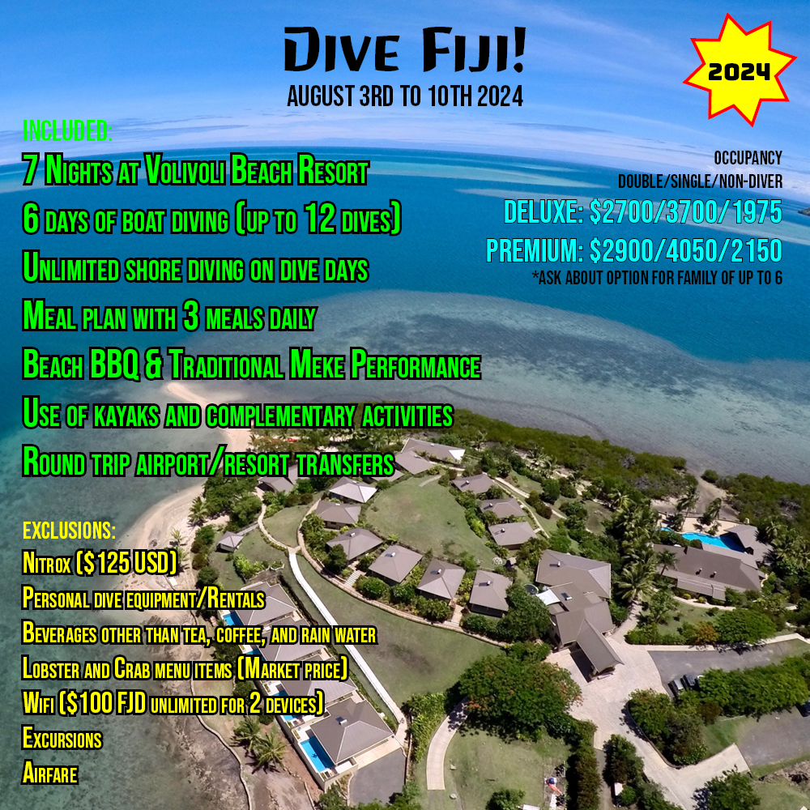

---

title: "Fiji 2024"
dividerIcon: "airplane-takeoff"
noheaderimage: true
teaser: "Come to Fiji with us and stay at the award winning 4-star Fiji dive resort Volivoli Beach Resort. The trip includes a 7-night stay, 6 days of boat diving (up to 12 dives) plus unlimited shore diving, 3 meals daily, beach BBQ, traditional Meke performance, and more."
tripStartDate: "2024-08-03"
tripEndDate: "2024-08-10"
image: FIJI_2024_Web_Advert.png
pagenav: 
  - name: travel
    url: /travel
---

Come to Fiji with us and stay at the award winning 4-star Fiji dive resort Volivoli Beach Resort. The trip includes a 7-night stay, 6 days of boat diving (up to 12 dives) plus unlimited shore diving, 3 meals daily, beach BBQ, traditional Meke performance, and more.

> Arriving at the resort by noon, you can go shore diving as soon as you are settled in, if you are up to it!

Volivoli Beach Resort is perched on the edge of the stunning Bligh Waters, with over 80 dive sites to scuba dive it is the perfect spot for any avid diver. With a purpose build dive and fishing boat fleet and onsite dive facility, Volivoli Beach Resort is Fiji’s premiere dive resort for scuba diving in Fiji. Volivoli has 3 bars and 2 onsite restaurants. Enjoy traditional Fijian culture with the local staff and villages on Meke night, complete with a Kava ceremony.

The Bligh Waters are renowned for an amazing display of fish, pelagic creatures and the best soft coral diving in Fiji. Volivoli Beach Resort owns and operates the best known Fiji scuba diving operation – Ra Divers. Based at the resort with a full equipped training facility, Nitrox and new state of the art camera facilities. Ra divers dive guides are all local Fijian Dive Masters who have grown up in the pristine waters of Fiji and who are keen to share their knowledge with our international visitors on their dive holiday. Need to take a break from diving? Enjoy Fiji’s best snorkeling directly off the beach, go kayaking, play beach volleyball, or ask about opportunities to go fishing, learn village culture, or go on dolphin encounters and sunset cruises.  

### Ammenities 

The following ammenities are included for all reservations:

* Round trip Nadi airport/resort transfers
* Welcome drink on arrival
* 7 nights accommodations at Volivoli Beach Resort
* Full meal plan – 3 meals daily with juice, milk, rain water, coffee, and tea at breakfast.
* Beach BBQ
* Traditional Meke performance
* Hosted group event on last night
* Free use of kayaks and participation in a variety of complimentary resort activities
* Resort and Government taxes

Divers will enjoy:

* 3 days of 2 tank boat diving & 2 days of 3 tank boat diving– includes tanks, weights, and dive guide
* Unlimited shore diving on dive days (reserve tanks 24 hours prior)

Package exclusions:

* Nitrox ($125 USD)
* Beverages other than tea, coffee, and rain water
* Lobster and Crab menu items (Market price)
* Personal dive equipment
* Night Dives (if the group is interested we can add this with a minimum of 6 divers; $125 US per tank)
* Excursions
* Dive and Travel Insurance (diving insurance is STRONGLY RECOMMENDED)
* Wifi for Divers and non divers ($100 FJD unlimited for 2 devices)

### Costs

Contact us today with questions or to reserve your spot with a $200/person deposit. We offer a payment schedule and the 1st Payment isn’t due until 5/1/23.

| Room | | Double Occupancy | | Single Occupancy | | non-diver
|------|-|------------------|-|------------------|-|-----------
| Deluxe || $2700 || $3700 || $1975
| Premium || $2900 || $4050 || $2150

* Room rates are per-person
* Option available for families of 4 to 6
* We recommend purchasing [DAN travel insurance](https://dan.org/partner/3016957/trip)

#### Payment Plan

Traveling is expensive and we understand the need to budget. We offer a payment schedule help!

Payments are due on the following dates: 5/1/23, 8/1/23, 11/1/23, 2/1/24, & 5/1/24

Each payment per person is:

| Room | | Double Occupancy | | Single Occupancy | | non-diver
|------|-|------------------|-|------------------|-|-----------
| Deluxe || $500 || $700 || $355
| Premium || $540 || $770 || $390

* If you join the trip after a payment date, all previous payments and deposit are due upon signup

### Travel Notes

#### Group Airfare

We will be coordinating group airfare between LAX and Nadi at an aditional cost for everyone interested. The group airfare will be booked around Oct 2023, we will keep you informed as we get closer to booking. If you would like to book your own flights please let us know.

#### International Date Line and Travel Dates

We will be on resort for 7 nights, from Saturday Aug 3rd to Saturday Aug 10th, however, due to the travel times and crossing the international date line, travel will need to start on Thursday Aug 1st. We will travel to LAX on Thursday, and there we will catch a 10 hour overnight flight from LAX to Nadi, where we will land on Saturday morning. We completely skip Friday, however on our return we will leave Nadi on Saturday Aug 10th and be back in the states also on Saturday Aug 10th, we land in LAX "before" we leave Nadi, welcome to time travel. 

#### COVID Advisory

Fiji currently requires travelers to have received the COVID vaccination, but continues to relax their entry requirements. More information can be found on the [Fiji travel page](https://www.fiji.travel/covid-19/travelling-to-fiji):

